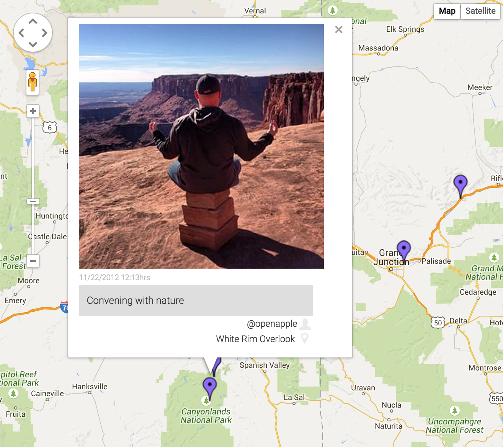

Karten
======



A WordPress plugin to plot Instagram posts to a Google Maps maps. This utilizes both the Google Maps v3 API and the Instagram API.

## Setup
- Obtain a [Google Maps v3 API key](https://code.google.com/apis/console) and save it in the Karten settings.
- Create a new client and obtain an [Instagram API Client ID](http://instagram.com/developer/clients/manage/) and save it in the Karten settings.
- Follow the instructions on the Karten settings page to obtain an Instagram API Acces Token, then save it.
- Create a new Map, filling out desired options. *Username(s) and/or hashtag required*.
- Copy the shortcode and insert it in the desired post/page content or use the [template hook](#template-hook) in your theme.
- Be amazed!

## Template Hook
To add a map outside of the content in a template file, use the `ktn_show_map` template hook:

```php
do_action( 'ktn_show_map', $integer );
```

=====

### Bugs / Support
Please do not directly email me for support - log all problems/bugs in the [GitHub issues](https://github.com/cfree/wp-karten/issues). I will address them as time permits. Pull requests are welcome.

### Limitations
Due to the limitations of the current Instagram API, the maximum posts displayed on a map is 33 or under.

